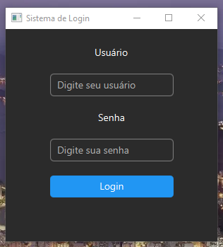

# 🔐 Sistema de Login em JavaFX

Este é um projeto simples de **tela de login** desenvolvido em **Java** utilizando **JavaFX**. O objetivo principal foi **recriar a mesma interface do meu projeto anterior em Python** ([Sistema de Login em Python](https://github.com/pitercoding/tela-de-login-python)), com o intuito de **desafiar minhas habilidades em Java e JavaFX**, mantendo uma interface moderna no modo escuro.

## 🚀 Funcionalidades

- Interface gráfica moderna com **JavaFX**
- Campos de entrada para **usuário** e **senha**
- Validação simples de login com feedback visual:
    - ✅ “Login Sucessful!” em verde quando correto
    - ❌ “Login Failed!” em vermelho quando incorreto

## 🖥️ Demonstração

Ao executar o programa, será exibida uma janela como esta:



## ⚙️ Tecnologias Utilizadas

- [Java 17+](https://www.oracle.com/java/technologies/javase/jdk17-archive-downloads.html)
- [JavaFX](https://openjfx.io/)

## 📦 Instalação

1. **Clone o repositório**
   ```bash
   git clone https://github.com/pitercoding/tela-de-login-javafx.git
    cd tela-de-login-javafx
   ```
2. **Configure o JavaFX no seu IDE** (IntelliJ, Eclipse, etc.)

* Certifique-se de adicionar o **SDK do JavaFX** ao projeto

3. **Compile e execute o projeto**

* Pelo IDE, execute a classe `app.LoginApp`
* Ou via terminal:
    ```bash
    javac --module-path /caminho/para/javafx-sdk/lib --add-modules javafx.controls app/LoginApp.java
    java --module-path /caminho/para/javafx-sdk/lib --add-modules javafx.controls app.LoginApp
    ```

## 🔑 Credenciais de Teste

Use as seguintes credenciais para testar o sistema:
```bash
    Usuário: piter
    Senha: 123456
```

## 📁 Estrutura do Projeto
```bash
    tela-de-login-javafx/
    │
    ├── app/
    │   └── LoginApp.java      # Código principal da aplicação
    ├── .gitignore             # Arquivos ignorados pelo Git
    └── README.md              # Este arquivo
```

## 🧠 Aprendizados

Este projeto foi criado com o objetivo de praticar:

- 🛠️ Criação de interfaces gráficas com **JavaFX**
- 🎨 Estilização moderna usando **CSS inline** no JavaFX
- 🔐 Estrutura básica de um **sistema de autenticação**

## 📜 Licença

Este projeto está sob a licença **MIT** — sinta-se à vontade para usar, estudar e modificar.

## 👤 Autor

**Piter Gomes**

📧 **E-mail:** [piterg.bio@gmail.com](mailto:piterg.bio@gmail.com)  
💼 **LinkedIn:** [linkedin.com/in/piter-gomes-4a39281a1](https://www.linkedin.com/in/piter-gomes-4a39281a1/)  
💻 **GitHub:** [github.com/pitercoding](https://github.com/pitercoding)  
🌐 **Portfólio:** [portfolio-pitergomes.vercel.app](https://portfolio-pitergomes.vercel.app/)

---


